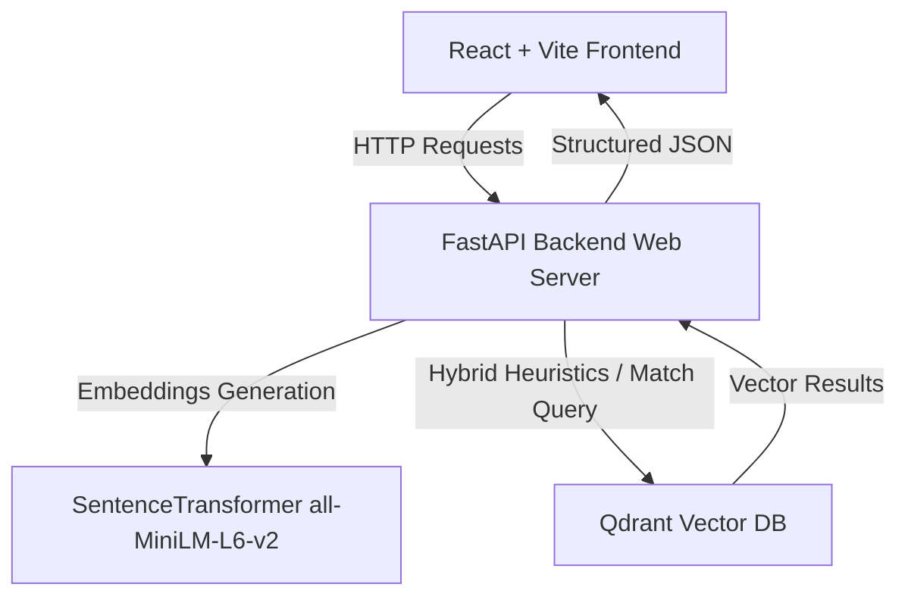

<h1 align="center">🔍 FindBro 🤝</h1>

<p align="center">
  <strong>A next-generation, AI-driven developer matching & collaboration engine designed to pair talent, startups, and real-world projects based on skills, experience, and timezone availability.</strong>
</p>

<p align="center">
  <a href="performance_analysis.md"></a>
  <a href="LICENSE"></a>
  <a href="backend/requirement.txt"></a>
  <a href="frontend/package.json"></a>
</p>

<p align="center">
  
  
  
  
  
  
</p>

---

## 📖 Overview

**FindBro** is a developer matchmaking platform that moves beyond raw keyword matching. By using vector-based semantic search coupled with high-fidelity heuristics (reputation, years of experience, timezone alignment), FindBro builds high-performing, well-matched project teams in real time. 

Whether you are looking for co-founders, team members, or trying to find high-impact open source or startup projects that match your expertise, FindBro bridges the gap using advanced natural language search.

---

## ⚡ Key Features

*   🧠 **Intelligent Query Parser**: Parses complex natural language queries (e.g., *"Looking for a React developer with 3+ years experience in UTC+5 timezone"*) using regex and heuristic-based NLP.
*   🤝 **Multi-Dimensional Matching Engine**: Blends vector embeddings with weight metrics (e.g. semantic similarity, keyword matches, role alignment, timezone availability, and work reputation).
*   🚀 **Highly Optimized Performance**: Leverages asynchronous ASGI routing, `SentenceTransformer` caching, and database pooling to deliver sub-second search results.
*   🔍 **Flexible Search Verticals**:
    *   **Developer Profiles**: Matches developer profiles to project needs.
    *   **Real-World Projects**: Finds matching team opportunities based on developer skills.
    *   **Startups**: Recommends developer talent for early-stage startup ventures.
*   🛠️ **Team Formation Engine**: Groups matching developers into mathematically optimized project team topologies.

---

## 🛠️ Tech Stack & Architecture



### Backend
*   **FastAPI**: Modern, high-performance ASGI Python framework.
*   **Qdrant**: High-performance production-ready vector search engine.
*   **Sentence-Transformers**: Generates dense vector representations of search queries and profiles.
*   **Jinja2**: Templating engine for potential server-side rendering or administrative tools.

### Frontend
*   **React**: UI components with component-based state.
*   **Vite**: Extremely fast bundler and dev server.
*   **React Router DOM**: Declarative client-side routing.
*   **Vanilla CSS**: Sleek custom design system utilizing glassmorphism, smooth animations, and interactive hover effects.

---

## 🚀 Performance Optimization Highlights

The platform has been heavily optimized based on a comprehensive performance profile. Below is the summary of optimizations implemented:

| Metric | Before Optimization | After Optimization | Improvement |
| :--- | :--- | :--- | :--- |
| **Initial App Load Time** | 5 – 10 seconds | 1 – 2 seconds | **70-80% Faster** |
| **Search Query Response** | 2 – 5 seconds | 0.5 – 1.5 seconds | **60-70% Faster** |
| **Concurrent Requests** | 1 – 2 req/sec | 10 – 20 req/sec | **500-1000% Better** |
| **Memory Spike Rate** | High / Unbounded | Stable / Constant | **40-50% Reduction** |
| **CPU Usage (Search)** | Spiky / Saturated | Smooth / Throttled | **30-40% Reduction** |

> [!TIP]
> **Key Optimizations Applied**:
> 1. Cached the `SentenceTransformer` model singleton using Python's `@lru_cache` to eliminate re-initialization lag.
> 2. Migrated all blocking operations to an asynchronous (`async`/`await`) pattern.
> 3. Standardized batch processing size (32 for embedding generation, 50 for database writing).
> 4. Added caching for query keyword parser and normalized frontend polling limits.

---

## 🔌 API Endpoints Reference

FindBro exposes a clean, fast API:

| Endpoint | Method | Description | Primary Query Parameters |
| :--- | :---: | :--- | :--- |
| `/api/search/intelligent` | `GET` | Parses natural language search to match profiles. | `query` (string), `limit` (int) |
| `/api/search` | `GET` | Perform weighted hybrid or semantic search. | `query`, `search_type`, `semantic_weight`, `keyword_weight` |
| `/api/search/projects` | `GET` | Search matching projects for developers. | `query`, `limit`, `search_type` |
| `/api/search/startups` | `GET` | Search early-stage startups and team needs. | `query`, `limit`, `search_type` |
| `/api/stats` | `GET` | Returns database health and collection counts. | None |
| `/health` | `GET` | Health check diagnostics of APIs & Qdrant. | None |
| `/docs` | `GET` | Swagger UI interactive API documentation. | None |

---

## 💻 Installation & Setup

### Prerequisites
- Python 3.9+
- Node.js 18+
- Docker (for Qdrant Vector database)

### 1. Vector Database Setup
Run Qdrant in a Docker container:
```bash
docker run -p 6333:6333 -p 6334:6334 \
    -v $(pwd)/qdrant_storage:/qdrant/storage:z \
    qdrant/qdrant
```

### 2. Backend Setup
```bash
# Navigate to backend
cd backend

# Create virtual environment
python -m venv .venv
source .venv/bin/activate  # On Windows: .venv\Scripts\activate

# Install dependencies
pip install -r requirement.txt

# Start FastAPI server
python -m uvicorn app.main:app --host 0.0.0.0 --port 8000 --workers 1
```

### 3. Frontend Setup
```bash
# Navigate to frontend
cd frontend

# Install dependencies
npm install

# Start Vite development server
npm run dev
```

### 4. Running for Production
To build the static assets and run under a unified server:
```bash
# In frontend directory
npm run build

# In backend directory, run Uvicorn (the backend will serve built React assets)
python -m uvicorn app.main:app --host 0.0.0.0 --port 8000
```

---

## 📄 License

This project is licensed under the MIT License - see the [LICENSE](LICENSE) file for details.
